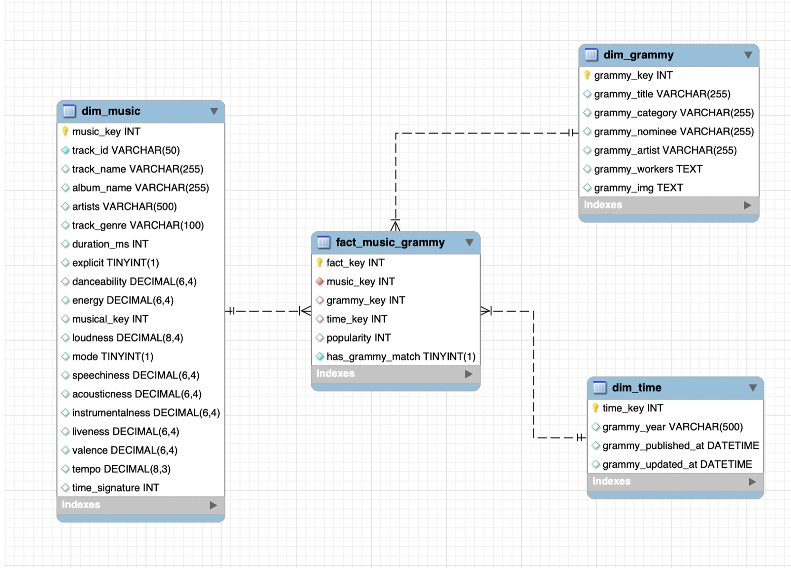

# ETL_workshop2

**Valentina Morales Valencia (2240427)**

---

## 1. Data Profiling (EDA)

### General information of the dataset spotify_dataset

- Number of rows: 114000  
- Number of columns: 21  
- Total memory used (MiB): 50.6 MiB  

| column_name | Data type | Missing values | % of missing values | Cardinality | Basic Statistics | duplicated data | Inconsistencies in writing | Notes |
|------------|----------|---------------|----------------------|-------------|------------------|-----------------|----------------------------|------|
| Unnamed: 0 | int64 | 0 | 0.00 | ... | Count = 114000 Mean = 56999.5 Std = 32909 Min = 0 Max = 113999 | ... | ... | It is not considered relevant for the analysis, to eliminate |
| track_id | object | 0 | 0.00 | 89741 | ... | Unexpected result: There are 24259 duplicates in the column | ... | It is the identifier of the song, it must be unique, so when it is repeated it shows an inconsistency. |
| artists | object | 1 | 0.0009 | 31438 | ... | Duplicate expected | Data are found that represent the same artist but written differently | They are the artists of a song |
| album_name | object | 1 | 0.0009 | 46590 | ... | Duplicate expected | Data are found that represent the same album_name but written differently | It's the name of the album |
| track_name | object | 1 | 0.0009 | 73609 | ... | Duplicate expected | Data are found that represent the same track_name but written differently | It's the name of the song |
| popularity | int64 | 0 | 0.00 | ... | Count = 114000 Mean = 33 Std = 22 Min = 0 Max = 100 | ... | ... | You can see that the data are approximately centered, which means that most songs have low or medium popularity and only some reach a high level of popularity represented as outliers. |
| duration_ms | int64 | 0 | 0.00 | ... | Count = 114000 Mean = 2 Std = 1 Min = 0 Max = 5 | ... | ... | It represents the duration in milliseconds, you can see many higher atypical values due to longer durations than usual, but it does not represent an error. |
| explicit | bool | 0 | 0.00 | ... | ... | ... | ... | Indicates if the song contains explicit content |
| danceability | float64 | 0 | 0.00 | ... | Count = 114000 Mean = 0.56 Std = 0.17 Min = 0 Max = 0.98 | ... | ... | It indicates how danceable the song is, you can see that most of the songs have a medium-high danceability, so the low values are presented as outliers. |
| energy | float64 | 0 | 0.00 | ... | Count = 114000 Mean = 0.64 Std = 0.25 Min = 0 Max = 1 | ... | ... | Energy level or intensity, you can see the presence of a wide dispersion and that the dataset is composed largely of energetic songs |
| key | int64 | 0 | 0.00 | ... | Count = 114000 Mean = 5.3 Std = 3.5 Min = 0 Max = 11 | ... | ... | Musical tonality encoded in number, it is seen as presenting a low dispersion and no outliers that exceed the 12 existing tones are presented |
| loudness | float64 | 0 | 0.00 | ... | Count = 114000 Mean = -8 Std = 5 Min = -49.5 Max = 4.5 | ... | ... | Average volume, as indicated by Spotify should be maximum -1 but positive numbers and many very low outliers are present. |
| mode | int64 | 0 | 0.00 | ... | Count = 114000 Mean = 0.6 Std = 0.48 Min = 0 Max = 1 | ... | ... | Musical mode where 1 is greater and 0 is smaller although the boxplot is not the best representation for this because it is badly classified as int64 although it represents a bool |
| speechiness | float64 | 0 | 0.00 | ... | Count = 114000 Mean = 0.08 Std = 0.1 Min = 0 Max = 0.96 | ... | ... | It shows how much spoken content the track has in the graph you can see that the average is in a very low range which indicates that most have little spoken content but many high outliers are presented in it. |
| acousticness | float64 | 0 | 0.00 | ... | Count = 114000 Mean = 0.3 Std = 0.3 Min = 0 Max = 0.99 | ... | ... | It shows the probability that it is acoustic, in it there is a lot of dispersion of the data but little acoustic songs predominate but you can see a very long queue that highly acoustic songs represent |
| instrumentalness | float64 | 0 | 0.00 | ... | Count = 114000 Mean = 0.15 Std = 0.3 Min = 0 Max = 1 | ... | ... | It shows the probability that it is instrumental, in it you can see a very small box which shows that the data are not so scattered and has little instrumental songs but also contain many superior outliers that indicate that there are some songs with a lot of instrumental |
| liveness | float64 | 0 | 0.00 | ... | Count = 114000 Mean = 0.2 Std = 0.19 Min = 0 Max = 1 | ... | ... | It shows the probability that it looks like a live recording, in it you can see that the average is very low but there are very high outliers present close to 1 in this you can see that the absence of a live recording predominates |
| valence | float64 | 0 | 0.00 | ... | Count = 114000 Mean = 0.47 Std = 0.25 Min = 0 Max = 0.99 | ... | ... | It shows how positive or cheerful it sounds, in this case the box contains a high dispersion and is very centered so it can be concluded that most of the songs have an intermediate level of being positive. |
| tempo | float64 | 0 | 0.00 | ... | Count = 114000 Mean = 122 Std = 29.9 Min = 0 Max = 243 | ... | ... | It shows the speed of the song in BPM, in which no relevant data is seen out of the ordinary for the most part. |
| time_signature | int64 | 0 | 0.00 | ... | Count = 114000 Mean = 3.9 Std = 0.4 Min = 0 Max = 5 | ... | ... | It shows the musical compass, in the graph you can see how most focus on a compass of 4 so it does not show much dispersion and has few outliers among them those located in 0 that are an inconsistency within the music |
| track_genre | object | 0 | 0.00 | 114 | ... | Duplicate expected | ... | Musical genre |

### General information of the dataset the_grammy_awards

- Number of rows: 4810 
- Number of columns: 10 
- Total memory used (MiB): 3.1 

| column_name  | Data type | Missing values | % of missing values | Cardinality | Basic Statistics                                      | duplicated data | Inconsistencies in writing                                              | Notes |
|--------------|----------|----------------|----------------------|-------------|------------------------------------------------------|----------------|-------------------------------------------------------------------------|-------|
| year         | int64    | 0              | 0.00                 | ...         | Count = 4810 Mean = 1995 Std = 17 Min = 1958 Max = 2019 | Duplicate expected | ...                                                                     | It represents the year of the Grammy edition to which the registration belongs, the format should be updated to object because it represents a year and not a number |
| title        | object   | 0              | 0.00                 | 62          | ...                                                  | Duplicate expected | ...                                                                     | Name of the event |
| published_at | object   | 0              | 0.00                 | 4           | ...                                                  | Duplicate expected | ...                                                                     | Date on which that record or that page was published on the website |
| updated_at   | object   | 0              | 0.00                 | 10          | ...                                                  | Duplicate expected | ...                                                                     | Date the registration was last updated on the website |
| category     | object   | 0              | 0.00                 | 638         | ...                                                  | Duplicate expected | Data are found that represent the same category but written differently | Prize category, it must be normalized to avoid inconsistencies in the data |
| nominee      | object   | 6              | 0.12                 | 4132        | ...                                                  | Duplicate expected | ...                                                                     | Name of the nominated work |
| artist       | object   | 1840           | 38.25                | 1659        | ...                                                  | Duplicate expected | Data are found that represent the same category but written differently | Main artist associated with the registration, it must be normalized to avoid inconsistencies in the data |
| workers      | object   | 2190           | 45.53                | 2367        | ...                                                  | Duplicate expected | Data are found that represent the same category but written differently | People involved in the work, it must be normalized to avoid inconsistencies in the data |
| img          | object   | 1367           | 28.42                | 1464        | ...                                                  | Unexpected duplicates | There is more than one artist associated with the same image, this generates inconsistencies in the records | Link of the image associated with the artist or registration, a single artist must be left linked to that image |
| winner       | bool     | 0              | 0.00                 | 1           | ...                                                  | Duplicate expected | ...                                                                     | Indicate if he won or not but they all find themselves in that if he won so it is not a necessary box for the analysis |

## Summary

### To synthesize the findings of the dataset (**spotify_dataset**) it can be said that:

- There is an unnecessary column inside the dataset which is `Unnamed: 0` that can be deleted.

- One of the columns is badly classified which is `mode` which is an int64 when it should be a bool.

- Only 3 rows have missing within the dataset

- There are columns that have non-natural ranges such as `loudness` that presents values of 0 and positive when it should not, and the `time_signature` that presents values of 0 when the minimum should be 1.

- In the evaluated columns which were the type object you can see that only one of the columns has an unexpected duplicate which is `track_id` where it is considered that all the values must be unique because it is the identifier of the song.

- Inconsistencies are found in the writing of some variables where despite being the same it is written in different ways, which are `artists`, `album_name` and `track_name`.

---

### To synthesize the findings of the dataset (**the_grammy_awards**) it can be said that:

- There is an unnecessary column within the dataset which is `winner` that can be deleted.

- One of the columns is misclassified which is `year` which is an int64 when it should be an object.

- 5403 rows have missing within the dataset

- An unexpected duplicate is found in `img` where more than one artist is linked to the same link

- There are inconsistencies in the writing of some variables where despite being the same it is written in different ways which are `category`, `artist`, `workers` and `img`.

## 2. Cleaning Actions with justification and before/after summary (spotify_dataset)

| Issue                          | Cleaning Strategy                                      | Justification                                                                                                                                     | Log Requirement |
|--------------------------------|--------------------------------------------------------|--------------------------------------------------------------------------------------------------------------------------------------------------|----------------|
| Unnecessary column (Unnamed: 0) | Drop column                                            | Delete columns that are not relevant in the dataset because they do not provide any information                                                 | Count removed  |
| Null artists                   | Delete rows with artists null                          | Because the name of the artist is not known and it cannot be invented because it alters the results, it is better to eliminate it              | Count removed  |
| Null album_name                | Delete rows with album_name null                       | Because the name of the album is not known and it cannot be invented because it alters the results, it is better to delete it                  | Count removed  |
| Null track_name                | Delete rows with track_name null                       | Because the name of the track is not known and it cannot be invented because it alters the results, it is better to eliminate it               | Count removed  |
| Positive in loudness           | Drop rows with loudness > -1                           | Positives cannot be interpreted in loudness                                                                                                      | Count dropped  |
| 0 in time_signature            | Drop rows with time_signature < 1                      | Cannot interpret values of 0 in time_signature                                                                                                   | Count dropped  |
| Duplicate track_id             | Assign track_id again, leaving the first occurrence the same | In order not to lose a significant amount of records, a new track_id is assigned for duplicates; these IDs are synthetic and not original from Spotify | Count reassigned |

### Before/after summary

| Aspects                      | Before                                                                 | After                                  |
|-----------------------------|------------------------------------------------------------------------|----------------------------------------|
| Row count                   | 114000                                                                 | 112408                                 |
| Null counts per column      | artists: 1 album_name: 1 track_name: 1                           | artists: 0 album_name: 0 track_name: 0 |
| Number of rows dropped per reason | rows_removed_null: 1 rows_removed_invalid_loudness: 456 rows_removed_invalid_time_signature: 1135 |                                        |

---

## 3. Cleaning Actions with justification and before/after summary (the_grammy_awards)

| Issue                         | Cleaning Strategy                                              | Justification                                                                                                                                     | Log Requirement |
|------------------------------|---------------------------------------------------------------|--------------------------------------------------------------------------------------------------------------------------------------------------|----------------|
| Unnecessary column (winner)  | Drop column                                                   | Delete columns that are not relevant in the dataset because they do not provide any information                                                 | Count removed  |
| Null nominee                | Delete rows with nominee null                                 | Because the name of the nominee is not known and cannot be invented because it alters the results, it is better to eliminate it               | Count removed  |
| Null artist                 | Delete rows with artists null                                 | Because the name of the artist is not known and it cannot be invented because it alters the results, it is better to eliminate it              | Count removed  |
| Null workers                | Delete rows with workers null                                 | Because the names of the workers are not known and cannot be invented because it alters the results, it is better to eliminate them           | Count removed  |
| Null img                    | Delete rows with img null                                     | Because the links of the images are not known and cannot be invented because it alters the results, it is better to eliminate them            | Count removed  |
| Duplicate img               | Remove duplicates linked to more than one artist              | Since there cannot be more than one artist linked to the same image, duplicates must be removed to ensure consistency                          | Count removed  |

### Before/after summary

| Aspects                         | Before                                                                                                  | After                                                  |
|---------------------------------|---------------------------------------------------------------------------------------------------------|--------------------------------------------------------|
| Row count                       | 4810                                                                                                    | 3983                                                   |
| Null counts per column          | nominee: 6 artist: 1840 workers: 2190 img: 1367                                                 | nominee: 0 artist: 0 workers: 0 img: 0         |
| Number of rows dropped per reason | rows_removed_null_nominee: 6 rows_removed_null_artist: 1834 rows_removed_null_workers: 2004 rows_removed_null_img: 132 rows_removed_confirmed_duplicate_img_artist: 7 |                                                        |

---

## 4. Transformation steps applied and rationale (General)

1. All data in the "mode" column was transformed to bool because this ensures that only bool type data is handled in the mode column.

2. All the data in the "year" column were transformed into object because this guarantees that they are taking years not numbers for their handling.

3. From the Spotify dataset the columns were standardized (artists, album_name, track_name, track_genre) and from the Grammy dataset the columns were standardized (category, nominee, artist, workers, img); ensuring that each of them has the same format with all the lowercase letters, remove spaces at the beginning and end, remove tildes, reduce double spaces, normalize simple signs.

4. Auxiliary columns will be created to be able to compare (track_name = nominee and artists = artist) these will be the columns that will allow us to merge between the two datasets, if coincidences are found the row will be filled with the information of the dataset the_grammy_awards

5. The columns of the datases the_grammy_awards will be renamed to avoid later confusion, these were the new columns

6. The_grammy_awards data is added if it matches Spotify.

---

## 5. granularity

### Fact Table: 

| Column |
|------|
| has_grammy_match |
| popularity |

---

### Dimension: `dim_music`

| Column |
|------|
| track_id |
| track_name |
| album_name |
| artists |
| energy |
| duration_ms |
| track_genre |
| danceability |
| valence |
| explicit |
| instrumentalness |
| acousticness |
| speechiness |
| loudness |
| mode |
| time_signature |
| liveness |
| tempo |
| music_key |

---

### Dimension: `dim_grammy`

| Column |
|------|
| grammy_category |
| grammy_workers |
| grammy_artist |
| grammy_img |
| grammy_title |
| grammy_nominee |

---

### Dimension: `dim_time`

| Column |
|------|
| grammy_year |
| grammy_published_at |
| grammy_updated_at |

---

## 6. Star schema design — ERD or table layout with column descriptions

---

## 7. Visualizations and KPIs with interpretation 

| KPI                                                        | Visualization            | KPI Value |
|-----------------------------------------------------------|--------------------------|----------|
| Total Spotify songs                                       | Card                     | It allows you to recognize the size of the dataset with which you are working in order to recognize the scope of the data you are working with and easily compare the relationship between the songs in the Spotify catalog with the Grammy winners of that catalog |
| Total Grammy Winning Spotify Songs                        | Card                     | With this information you can know how many of the songs that Spotify contains in its database have been winners of the Grammy to know if much of its database contains a list of songs valued by the Grammys and recognize that part of its catalog has high value provided by the industry |
| Grammy winning songs with the highest popularity on Spotify | Horizontal bar chart     | It allows to identify the Grammy winning songs that are also highly popular on Spotify, it also helps to recognize titles with greater potential for promotion, positioning in playlists, marketing campaigns and use of the music catalog |
| Percentage of Grammy-winning songs with explicit content  | Cake chart               | It allows you to identify what percentage of the Grammy winning songs contain explicit content in their lyrics, with this you can distinguish what quality of lyrics the Grammys are evaluating in addition to helping to segment the audience and define the dissemination restrictions |
| Total Grammy winning songs by genre                       | Bar chart                | It allows to identify the genre that has most influenced the Grammys that belongs to the Spotify catalog, thus helping to identify the musical genre with the greatest possibility of prestige and dissemination |
| Grammy winning songs per year                             | Line chart               | It allows you to identify the years in which a Grammy was won within the Spotify song catalog, it helps to identify trends by period |

